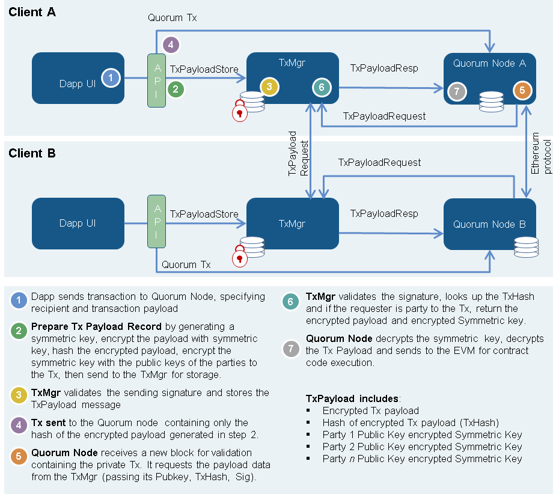

# Quorum

Quorum is an Ethereum-based distributed ledger protocol that has been developed to provide the Financial Services industry with a permissioned implementation of Ethereum that supports transaction and contract privacy.

The key components are:

* __QuorumChain__ - a new consensus model based on majority voting
* __Constellation__ - a peer-to-peer encrypted message exchange
* __Peer Security__ - node/peer permissioning using Smart Contracts

## Architecture



The above diagram is a high-level overview of the privacy architecture used by Quorum. For more in-depth discussion of the components, refer to the wiki pages.

## Quickstart

The quickest way to get started with Quorum is using [VirtualBox](https://www.virtualbox.org/wiki/Downloads) and [Vagrant](https://www.vagrantup.com/downloads.html). Once you have both installed, run the following:

```sh
git clone https://github.com/jpmorganchase/quorum-examples
cd quorum-examples/vagrant
vagrant up
# (should take 5 or so minutes)
vagrant ssh
```

Now that you have a fully-functioning Quorum environment set up, let's run the 7-node cluster example. This will spin up several nodes with a mix of voters, block makers, and unprivileged nodes.

```sh
# (from within vagrant env, use `vagrant ssh` to enter)
ubuntu@ubuntu-xenial:~$ cd quorum-examples/7nodes

$ ./init.sh
# (output condensed for clarity)
[*] Cleaning up temporary data directories
[*] Configuring node 1
[*] Configuring node 2 as block maker and voter
[*] Configuring node 3
[*] Configuring node 4 as voter
[*] Configuring node 5 as voter
[*] Configuring node 6
[*] Configuring node 7

$ ./start.sh
[*] Starting Constellation nodes
[*] Starting bootnode
wait for bootnode to start...
[*] Starting node 1
[*] Starting node 2
[*] Starting node 3
[*] Starting node 4
[*] Starting node 5
[*] Starting node 6
[*] Starting node 7
[*] Unlocking account and sending first transaction
Contract transaction send: TransactionHash: 0x5828de9bf1c11d0db7cde96337c3c4d678da93a9040ac0790d38518e5f8c072d waiting to be mined...
true
```

We now have a 7-node Quorum cluster with a [private smart contract](https://github.com/jpmorganchase/quorum-examples/blob/master/7nodes/script1.js) (SimpleStorage) sent from `node1` to `node7` (denoted by the public key `ROAZBWtSacxXQrOe3FGAqJDyJjFePR5ce4TSIzmJ0Bc=`).

Connect to any of the nodes and inspect them using the following commands:

```sh
geth attach ipc:qdata/dd1/geth.ipc
geth attach ipc:qdata/dd2/geth.ipc
...
geth attach ipc:qdata/dd7/geth.ipc


# e.g.

$ geth attach ipc:qdata/dd2/geth.ipc
Welcome to the Geth JavaScript console!

instance: Geth/v1.5.0-unstable/linux/go1.7.3
coinbase: 0xca843569e3427144cead5e4d5999a3d0ccf92b8e
at block: 679 (Tue, 15 Nov 2016 00:01:05 UTC)
 datadir: /home/ubuntu/quorum-examples/7nodes/qdata/dd2
 modules: admin:1.0 debug:1.0 eth:1.0 net:1.0 personal:1.0 quorum:1.0 rpc:1.0 txpool:1.0 web3:1.0

> quorum.nodeInfo
{
  blockMakerAccount: "0xca843569e3427144cead5e4d5999a3d0ccf92b8e",
  blockmakestrategy: {
    maxblocktime: 10,
    minblocktime: 3,
    status: "active",
    type: "deadline"
  },
  canCreateBlocks: true,
  canVote: true,
  voteAccount: "0x0fbdc686b912d7722dc86510934589e0aaf3b55a"
}
```

## Further Reading

Further documentation can be found in the [docs](docs/) folder and on the [wiki](https://github.com/jpmorganchase/quorum/wiki/).

## See also

* Quorum - https://github.com/jpmorganchase/quorum (this repository)
* Constellation - https://github.com/jpmorganchase/constellation
* quorum-examples - https://github.com/jpmorganchase/quorum-examples
* Quorum Wiki - https://github.com/jpmorganchase/quorum/wiki

## Contributing

Thank you for your interest in contributing to Quorum!

Quorum is built on open source and we fully intend to accept public contributions in the near future. There are many ways to contribute, and we appreciate all of them, so stay tuned to this space.

## License

The go-ethereum library (i.e. all code outside of the `cmd` directory) is licensed under the
[GNU Lesser General Public License v3.0](https://www.gnu.org/licenses/lgpl-3.0.en.html), also
included in our repository in the `COPYING.LESSER` file.

The go-ethereum binaries (i.e. all code inside of the `cmd` directory) is licensed under the
[GNU General Public License v3.0](https://www.gnu.org/licenses/gpl-3.0.en.html), also included
in our repository in the `COPYING` file.
