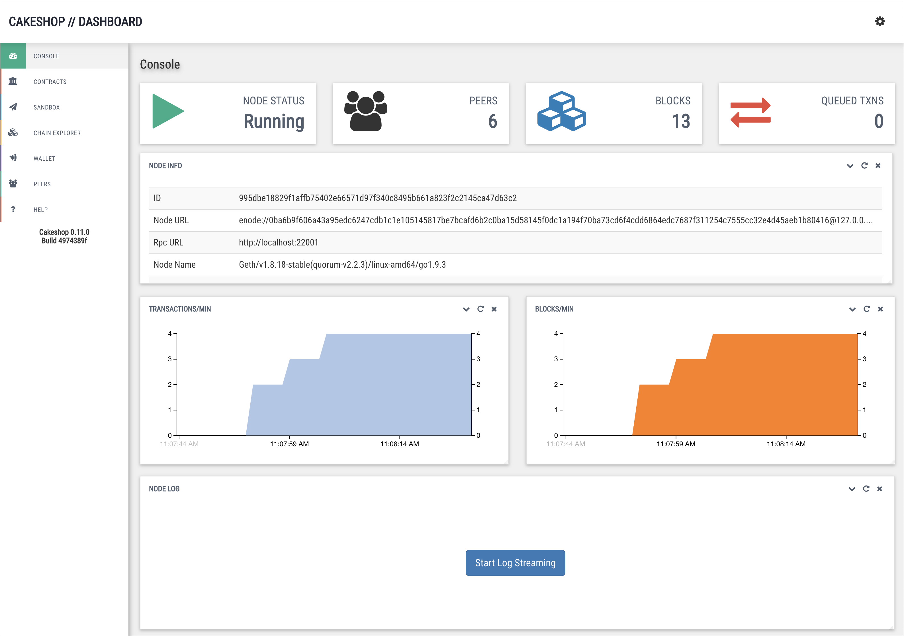

## What is it?

[Cakeshop](https://github.com/jpmorganchase/cakeshop) is a set of tools and APIs for working with Quorum nodes, packaged as a Java web application archive (WAR) that gets you up and running in under 60 seconds.
                                                      
It provides tools for attaching to and managing a quorum node, exploring the state of the chain, and working with contracts.

Out of the box you get:

* **Blockchain Explorer** - view transactions, blocks and contracts, and see historical contract state at a point in time
* **Peer Management** - easily discover, add and remove peers
* **Solidity Sandbox** - develop, compile, deploy and interact with Solidity smart contracts

### Running Cakeshop

For instructions on getting Cakeshop up and running, see [Getting Started](../Getting%20Started)