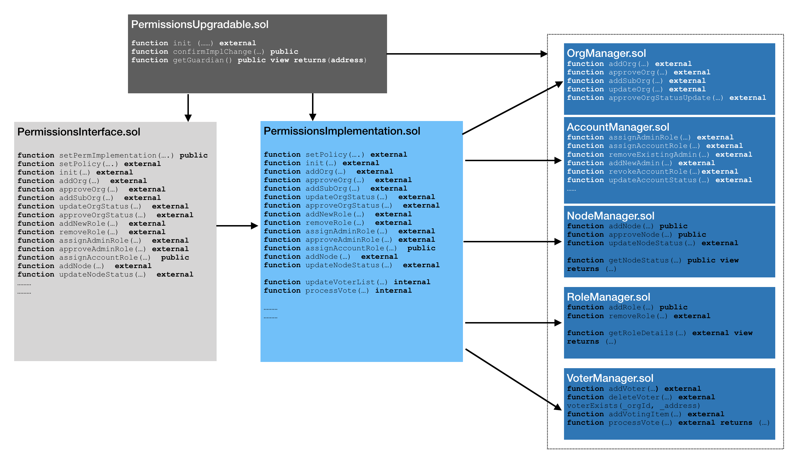

# Smart Contract design for permissions
The permissions model is completely built on smart contracts. The smart contract design is as below:

The permissions smart contract design follows the Proxy-Implementation-Storage pattern which allows the implementation logic to change without changing the storage or interface layer. Brief description of the smart contracts is as below:
* `PermissionsUpgradable.sol`: This contract stores the address of current implementation contract and is owned by a custodian(an Ethereum account). Only custodian is allowed to change the implementation contract address. 
* `PermissionsInterface.sol`: This is the interface contract and holds the interfaces for permissions related actions. This does not have any business logic and it forwards requests to current implementation contract
* `PermissionsImplementation.sol`: This contract has the business logic for the permissions actions. This contract can receive requests only from a valid interface as defined in `PermissionsUpgradable.sol` and interact with all the storage contracts for respective actions.
* `OrgManager.sol`: This contract stores data for organizations and sub organizations. This contract can receive request from valid implementation contract as defined in `PermissionsUpgrdable.sol`
* `AccountManager.sol`: This contract receives requests from valid implementation contract as defined in `PermissionsUpgrdable.sol`. This contracts stores the data of all accounts, their linkage to organization and various roles. This contracts also stores the status of an account. The account can be in any of the following states - `PendingApproval`, `Active`, `Suspended`, `Blacklisted`, `Revoked`
* `NodeManager.sol`: This contract receives requests from valid implementation contract as defined in `PermissionsUpgrdable.sol`. This contracts stores the data of a node, its linkage to a organization or sub organization and status of the node. The node status can be any one of the following states - `PendingApproval`, `Active`, `Deactivated`, `Blacklisted`
* `RoleManager.sol`: This contract receives requests from valid implementation contract as defined in `PermissionsUpgrdable.sol`. This contract stores data for various roles and the organization to which it is linked. At access at role level can be any one of the following: `Readonly` which allows only read operations, `Transact` which allows value transfer but no contract deployment access, `ContractDeploy` which allows both value transfer and contract deployment access and `FullAccess` which allows additional network level accesses in addition to value transfer and contract deployment. If a role is revoked all accounts which are linked to the role lose all access rights.
* `VoterManager.sol`: This contract receives requests from valid implementation contract as defined in `PermissionsUpgrdable.sol`. This contract stores the data of valid voters at network level which can approve identified activities e.g. adding a new organization to the network. Any account which is linked to a predefined network admin role will be marked as a voter. Whenever a network level activity which requires voting is performed, a voting item is added to this contract and each voter account can vote for the activity. The activity is marked as `Approved` upon majority voting.
