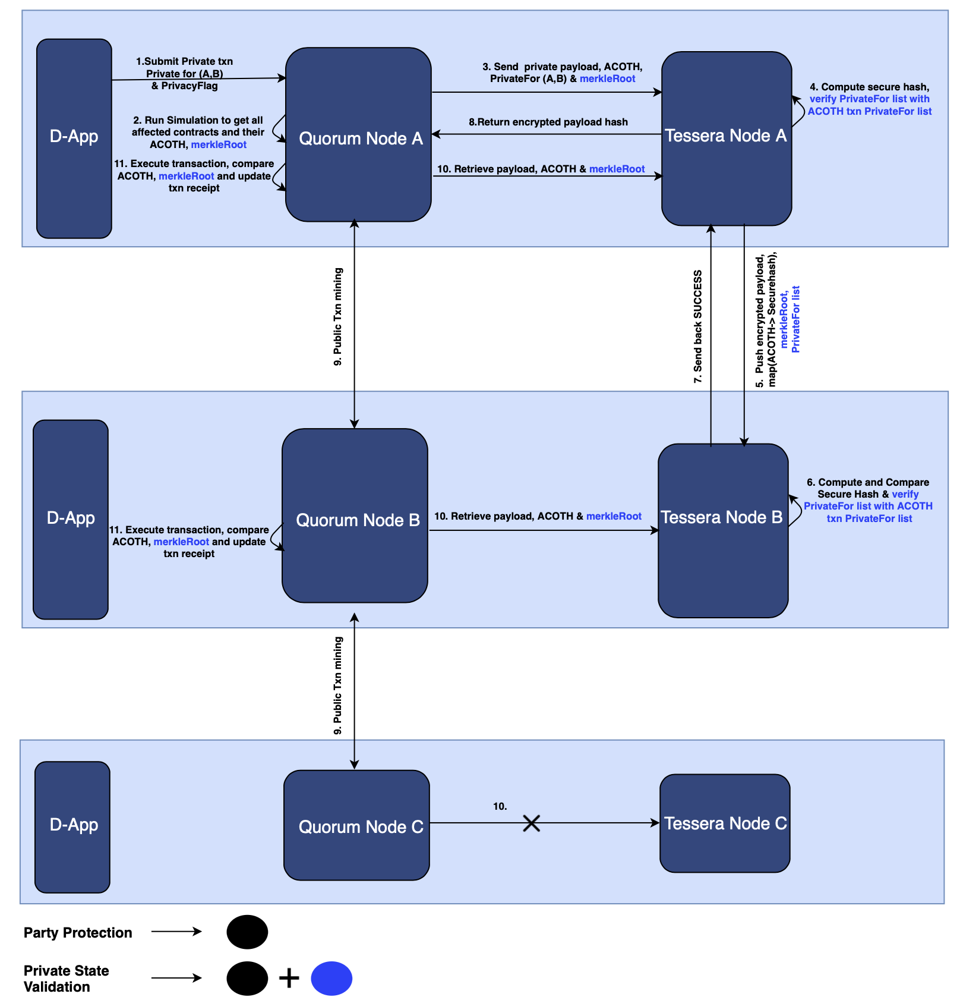

# Overview

Before Quorum 2.7.0 any node in the Quorum network could alter the state of a contract even if it never had the contract byte code (was not party to the private transaction that created the contract). The privacy enhancements feature has been developed to prevent such 'non-party' interaction. This is achieved with the introduction of the `ACOTH` which is short for "Affected Contract's Original Transaction's encrypted payload Hash". 
In order to transact with a contract a node must prove it has access (has the encrypted payload and the ability to decrypt it) to the contract's originating transaction.
Two flavours of privacy enhanced transactions have been introduced: a) Counter party protection and b) Private state validation.

## Counter Party Protection (PP)

This flavor prevents non-party interaction on a private contract but allows state divergence i.e., it will allow nodes to maintain different state through private transaction to 'self' or 'subset of nodes'. 

## Private State Validation (PSV)

This flavor uses all the verifications of counter party protection. On top of those it introduces further checks preventing nodes from state deviation by failing private transactions to 'self' or 'subset of nodes' by sharing the full list of recipients among all nodes which is validated against all subsequent transactions (in standard private/party protection mode only the sending node knows the list of recipients). 

## Key Enhancements

### Privacy Flag

A new parameter `PrivacyFlag` has been added to all Quorum [send](http://docs.goquorum.com/en/latest/Getting%20Started/api/) API methods, being passed from the client to enable the privacy enhancements feature. This flag is an unsigned integer with the following values: 1 for PP (Party Protection) and 3 for PSV (Private State Validation) transactions. If the flag is missing or zero, the transaction is assumed to be a 'non-privacy enhanced' SP (Standard Private) transaction. 

### Privacy Metadata and Privacy Metadata Trie

Privacy Metadata is a new structure introduced in Quorum. It is stored in the quorum DB in the privacy metadata trie (which is linked to the private state - via root hash mappings). The Privacy Metadata contains the ACOTH and privacyFlag.

Privacy Metadata Trie is a parallel trie that stores the privacy metadata (and whatever extra data we may need) for the private contracts and is linked to the private state by root hash mappings. The records in the trie are keyed by the contract address (similarly to how the contract/accounts data is stored in the state trie).

Each contract(account) that is created as the result of a 'PP' or 'PSV' transaction would have such a structure attached to the privacy metadata trie as it is essential in performing checks on future transactions affecting those contracts.

### Transaction simulation

In order to discover what ACOTH(s) to attach to a transaction the quorum node simulates the execution of the proposed transaction. The result of the simulation relies on the current state of the chain.
The ethereum VM has been enhanced to track the contracts involved in the simulated transaction. 
At the end of the simulation the EVM can report all the created/invoked contract addresses. 
Coupled with the privacy metadata described above it is easy to translate contract addresses to ACOTHs and attach them to the proposed transaction.

#### Limitations
Depending on the complexity of the contracts and the throughput of the network it may happen that the state at simulation time may differ from the chain state at the time the proposed transaction is minted.
If the state at minting time is sufficiently altered to determine different contract interactions the corresponding PP/PSV transactions would be marked as failed on all the participants.
Furthermore, since state divergence is expected in PP contracts, it is possible (depending on contract design) for PP transactions to fail on some of the participants.

Concurrency may also present a problem for PSV contracts. The execution hash calculation is based on the chain state at simulation time. Submitting multiple transactions to the same PSV contract from multiple nodes concurrently is likely to result in most of the transactions failing.

Considering the above we expect users to choose PP and PSV contracts/transactions **only** when the enhanced privacy is absolutely necessary (and the extra privacy benefits outweigh the potential shortfalls).
 
### Contract/Transaction interactions 

No interactions are allowed between the different types of private contracts/transactions. The only type of allowed interaction is for private contracts (SP/PP/PSV) to read from public contracts.

Legend: 
* RW - read/write
* R - read only
* NP - not permitted

Axis:
* vertical - calling contract/transaction
* horizontal - called contract 

<table>
    <tr><td></td><th>Public</th><th>SP</th><th>PP</th><th>PSV</th></tr>
    <tr><th>Public</th><td>RW</td><td>NP</td><td>NP</td><td>NP</td></tr>
    <tr><th>SP</th><td>R</td><td>RW</td><td>NP</td><td>NP</td></tr>
    <tr><th>PP</th><td>R</td><td>NP</td><td>RW</td><td>NP</td></tr>
    <tr><th>PSV</th><td>R</td><td>NP</td><td>NP</td><td>RW</td></tr>
</table>

The privacy enhancements feature only performs it’s checks on submitted/minted transactions. 
None of the above limitations apply to calls (read only transactions) - contract method invocations that are executed locally and do not result in minted transactions.

## Configuration Changes

### Quorum

Genesis.json file has been modified to include `privacyEnhancementsBlock`. The values for this should be set to an appropriate value in the future (and should be initialised with same value across all the nodes in the network) by when the entire network would be ready to transact with privacy enhanced contracts/transactions. 

### Tessera

New flag `enableEnhancedPrivacy` has been added to Tessera config defaulting to `FALSE`, and can be enabled by adding the property to the config file the same way as other features. Refer sample configuration for further details.

## Enabling Privacy Enhancements in the Quorum Network 

For any given node the privacy manager (Tessera) is started first and for that reason we allow the Tessera node to be upgraded with privacy enhancements support ahead of Quorum upgrade. But when Quorum node is upgraded and geth is reinitialised with `privacyEnhancementsBlock`, Quorum node will validate the version of Tessera running and will fail to start if Tessera is not running an upgraded version. The Quorum node reports an appropriate error message in the console suggesting users to upgrade Tessera first.

If a node wants to upgrade it's Tessera to privacy enhancements release (or further) to avail other features and fixes but not ready to upgrade Quorum, it can do so by not enabling `enableEnhancedPrivacy` in Tessera config. This will allow the node to reject PP and PSV transactions from other nodes until the node is ready to support privacy enhanced contracts/transactions.

## Backward compatability

### Quorum

An upgraded Quorum node can coexist on a network where other nodes are running on lower version of Quorum and thus supports node by node upgrade. But it cannot support privacy enhanced contracts until all interested nodes are upgraded and privacy 'enabled'. 
If an upgraded but privacy not 'enabled' node receives a PSV or PP transaction the node would log a `BAD BLOCK` error with “Privacy enhanced transaction received while privacy enhancements are disabled. Please check your node configuration.” error message. If the consensus algorithm is raft, the node would stop. For Istanbul, the node would keep trying to append the problematic block and reprint the above errors and it won't catch up with rest of nodes until restarted and reinitialized with the correct `privacyEnhancementsBlock`.

### Tessera 

On any given node, Tessera can be upgraded to privacy enhanced release anytime but care must be taken as when to enable `enableEnhancedPrivacy` flag in Tessera config as once the flag is enabled, it will accept PSV and PP transactions and can cause the node to crash if Quorum node is not privacy enabled. The upgraded node can continue to communicate on Tessera nodes running on previous versions using `Standard Private` transactions. API versioning(add hyperlink later) to be introduced along with privacy enhancement enables the upgraded node to determine if the receiving node supports privacy enhancements or not and fail the transaction then and there. 

## Tessera P2P communication changes

Refer [here](http://docs.goquorum.com/en/latest/Privacy/Lifecycle-of-a-private-transaction/) to refresh about Tessera P2P communication.

### Party Protection changes

To prevent a non-party node from interacting with PP contracts new transactions must be submitted with `ACOTHs` and `PrivacyFlag` from Quorum to Tessera. The Tessera node would then generate proofs (a hash using new transaction ciphertext, original transaction ciphertext and original transaction master key) for each ACOTH and include a) `PrivacyFlag`, b) ACOTHs and c) ACOTH proofs (secure hashes) in the transaction payload shared between Tessera nodes.

### Private State Validation changes

Besides the ACOTH, a PSV transaction has an execution hash (merkle root) calculated from all the affected contract(s) resulting from the transaction simulation (at the time of submission) included from Quorum to Tessera. The d) execution hash and e) list of participants are also shared between Tessera nodes.

## Privacy Enhanced Transaction End to End Flow

Refer [here](http://docs.goquorum.com/en/latest/Privacy/Lifecycle-of-a-private-transaction/) for end to end flow of 'standard' private transaction.

In this example we walk through the flow of a private transaction on a 'privacy enhanced contract' between Nodes A & B.

1. User pushing a private transaction from Node A private for Node B

    - The transaction payload will include the `PrivacyFlag` with value `1` for PP and `3` for PSV contract

2. Node A Quorum reading the `PrivacyFlag` runs an EVM transaction simulation to gather all the affected contracts and the ACOTH(s) associated to contract accounts. For PSV transactions, it also calculates an execution hash (merkle root) from all the affected contracts resulting from the transaction simulation.

3. Node A Quorum pushes the transaction payload, `PrivacyFlag`, ACOTHs (& the merkle root for `PSV`) to Node A Tessera.

4. Node A Tessera generates proofs (secure hashes) for the ACOTHs and use them to validate that the originating party has access to all relevant transactions. In addition for `PSV` it would also verify the participants list against the list in each of the ACOTH transactions (as in `PSV` transactions the recipient list is shared across all nodes party to the transaction). If the list doesn't match it will return failure on `/send` to Node A Quorum.

5. Node A Tessera pushes to Node B Tessera the encrypted payload, ACOTH <-> proofs (secure hash) mappings (for `PSV` transaction it will also push the `privateFor` list and merkle root).

6. Node B Tessera computes and compares proofs (secure hash) from Node A Tessera (for `PSV` it also verifies participants list of ACOTHs against the `privateFor` list). 

7. Node B Tessera returns a SUCCESS response to Node A Tessera - even if the compute and compare mismatched (in order to prevent Node A finding out the recipient list of a contract/transaction) but it will not store the payload/ACOTH<->Securehash mapping based on the outcome.

8. Node A Tessera returns the hash for the encrypted transaction payload to Node A Quorum

9. Node A mints the transaction across the network.

10. Node A & Node B being party to the contract will `/receive` decrypted payload, ACOTHs (for `PSV` also merkle root) from the respective Tessera Nodes.

11. Both Nodes execute the transaction and compare the ACOTHs (and execution hash for `PSV`) and update the transaction receipt accordingly to mark transaction execution completion.

**Note : If the EVM simulation impacts more than one contract, all contracts should have the same `PrivacyFlag`, otherwise the transaction is rejected. All contracts ACOTHs are included in the transmission and the Tessera node will create individual proofs (secure hash) for each ACOTH.**

**Note : TODO - add extra details about EVM simulation and the potential problems arising from differing results caused by state changes that occur between transaction simulation and minting.**  
