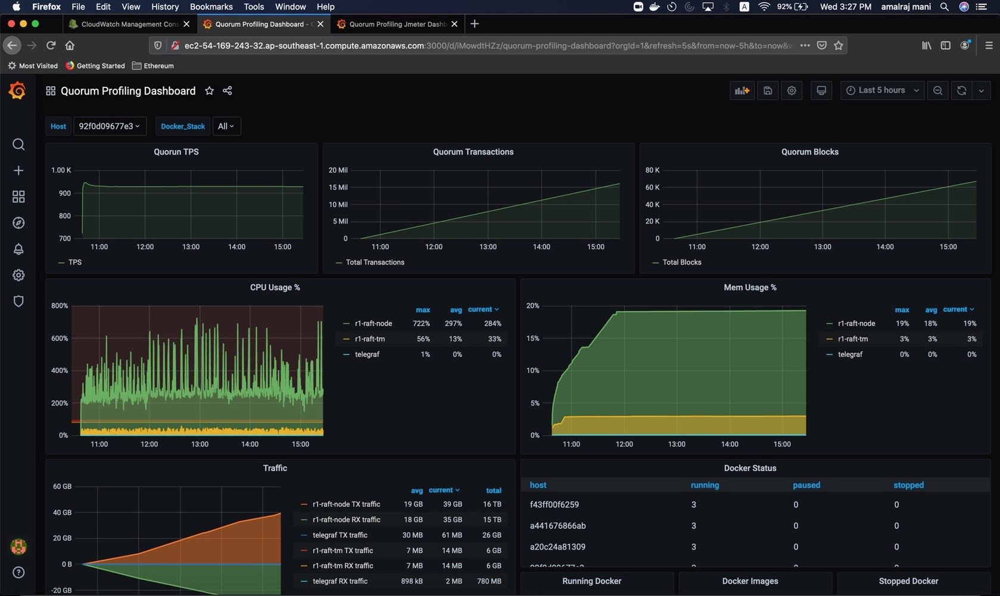
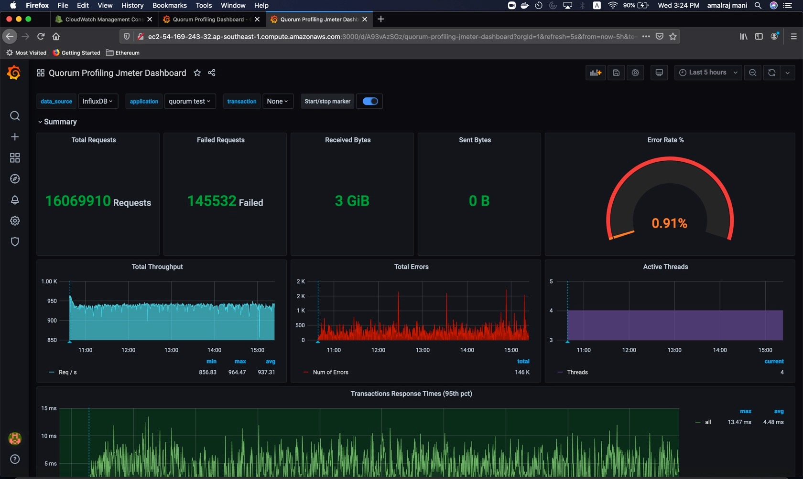

# Quorum Profiling

[Quorum Profiling](https://github.com/QuorumEngineering/quorum-test) is a custom toolset which could be used to benchmark transaction throughput and network statistics on any existing Quorum network using the Jmeter & TPS monitoring tool profiles. Alternatively it could also be used to spin up an entire quorum network from scratch in AWS and benchmark the network for TPS, CPU/Memory usage. The various scenarios of usage is explained [here](https://github.com/QuorumEngineering/quorum-test)

## Metrics Visualisation

The tool executes the stress test profile selected and then collects the following metrics:

 * CPU/Memory usage for both `Quorum` & `tessera`
 * Transaction & Block count
 * Transaction processing speed
 * `Jmeter` test execution statistics
 
 These metrics could be configured to be stored in an InfluxDB or Prometheus time-series database for further analysis. Both databases integrate well with the open source dashboard editor Grafana to allow for easy creation of dashboards to visualise the data being captured from the profiling tool. Sample dashboards below:
 
### Sample Network Dashboard 

 
 
### Sample JMeter Dashboard

 
