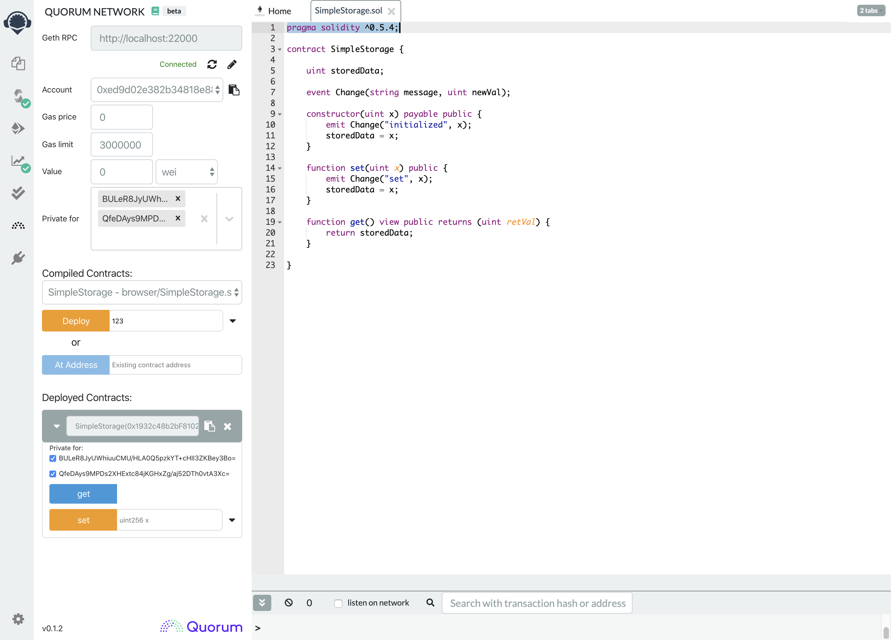

# Quorum Plugin for Remix

The Quorum plugin for Ethereum's Remix IDE adds support for creating and interacting with private contracts on a Quorum network.

## Getting Started

Just go to the [Remix IDE](https://remix.ethereum.org) and activate the **Quorum Network** plugin on the plugins page. For step-by-step instructions, go to the [Getting Started](../Getting%20started) doc.

## Common Issues

**HTTP/HTTPS:**
- Most browsers will not allow you to connect to an HTTP resource if you are currently on an HTTPS page. Since our plugin is currently loaded from HTTPS, it will not let you connect to a Quorum node that doesn't have an https url. **Chrome makes an exception for localhost**, so you should be able to connect to http://localhost:22000, for example. Firefox seems to be a little more strict than Chrome at the moment and does not allow these localhost calls. We are tracking this issue in [quorum-remix#8](https://github.com/jpmorganchase/quorum-remix/issues/8), but until that is fixed please use Chrome or another browser that doesn't block these requests. 

## Contributing
Quorum Plugin for Remix is built on open source and we invite you to contribute enhancements. Upon review you will be required to complete a Contributor License Agreement (CLA) before we are able to merge. If you have any questions about the contribution process, please feel free to send an email to [info@goquorum.com](mailto:info@goquorum.com).
