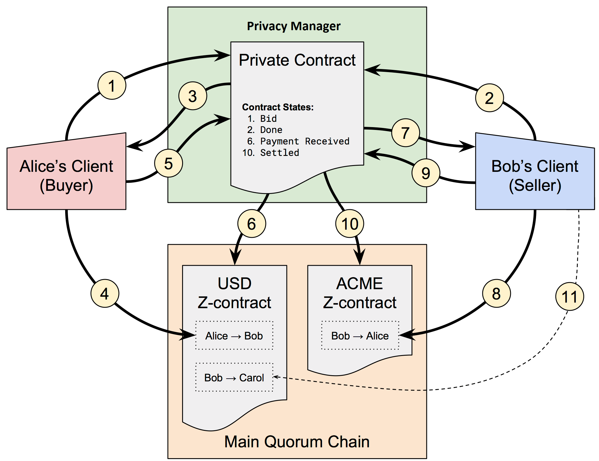
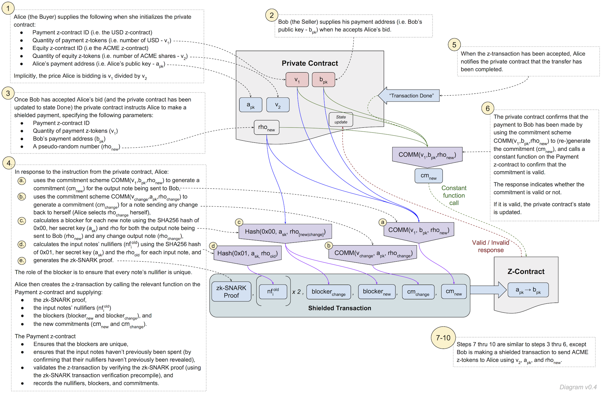

# ZSL Proof of Concept

!!! caution
    The POC discussed in this section should not be considered production-ready

## Overview
Quorum supports both Public Contracts (which are executed in the standard Ethereum way, and are visible to all participants in the distributed ledger) and Private Contracts (which are shared between the parties to the private contract using Tessera, but can not be read by other participants). This approach preserves the privacy of the parties to the private contract, and the confidentiality of the private contract’s business logic. However, a key limitation is that it does not support prevention of double-spending for digital assets that are exchanged within private contracts. 

ZSL (zero-knowledge security layer) is a protocol designed by the team behind Zcash, that leverages zk-SNARKS to enable the transfer of digital assets on a distributed ledger, without revealing any information about the Sender, Recipient, or the quantity of assets that are being transferred. 

J.P. Morgan and the Zcash team partnered to create a proof of concept (POC) implementation of ZSL for Quorum, which enables the issuance of digital assets using ZSL-enabled public smart contracts (z-contracts). We refer to such digital assets as “z-tokens”. Z-tokens can be shielded from public view and transacted privately. Proof that a shielded transaction has been executed can be presented to a private contract, thereby allowing the private contract to update its state in response to shielded transactions that are executed using public z-contracts. 

This combination of Tessera’s private contracts with ZSL’s z-contracts, allows obligations that arise from a private contract, to be settled using shielded transfers of z-tokens, while maintaining full privacy and confidentiality.

For more background, please read the [POC Technical Design Document](https://github.com/jpmorganchase/zsl-q/blob/master/docs/ZSL-Quorum-POC_TDD_v1.3pub.pdf).

## Implementation
The ZSL proof of concept has been implemented as follows: 

* ZSL-specific code resides in the [zsl-q](https://github.com/jpmorganchase/zsl-q) repo
* The Quorum integration is implemented as a separate branch of the Quorum repo - [zsl_geth1.5](https://github.com/jpmorganchase/quorum/tree/zsl_geth1.5)
* There is also a ZSL-specific branch of the quorum-examples repo - [zsl_geth1.5](https://github.com/jpmorganchase/quorum-examples/tree/zsl_geth1.5)
* The [zsl-q-params](https://github.com/jpmorganchase/zsl-q-params) repo contains the shared parameters required for generating and verifying the zk-SNARK proofs.

Full instructions on how to install Quorum with ZSL can be found in the [zsl-q README](https://github.com/jpmorganchase/zsl-q/blob/master/README.md).

Please note that this POC is intended to demonstrate how ZSL can complement Quorum, and provide a platform for experimentation and exploration of different use cases. It implements a simplified, stripped-down version of the Zerocash protocol to enable rapid prototyping. There is no formal security proof for the protocol, exception-handling has not been implemented for proof verification, the software has not been subjected to rigorous testing, and **it should not be considered “production-ready”**. 

Broadly speaking, Quorum ZSL supplies a contract within which virtual funds can be "bundled" into cryptographically obfuscated "notes". Each note represents a store of value, and can be unlocked, or "redeemed", only using a secret spending key. To effect a private transfer, Alice may bundle value into a note, and then transmit the note's secret key to Bob through a private, off-chain channel. Bob may then redeem this note on-chain, revealing, in the process, no public link between Alice and himself. Note that in a previous version, a failure to link _Ethereum_ and _note_ signatures made possible a sort of "front-running" attack; this has been fixed by PR [#587](https://github.com/jpmorganchase/quorum/pull/587).

## Equity Trade use case example
The following example illustrates a specific use case for Quorum with ZSL - a simple equity trade where Alice is buying ACME shares from Bob. The POC includes a demonstration that implements this example; instructions on how to run it can be found [here](https://github.com/jpmorganchase/zsl-q/blob/master/README.md#example-2---private-contract-trade).

### Beginning State:
* Z-contracts have been created for US dollars (the USD z-contract) and ACME shares (the ACME z-contract),
* Z-tokens have been issued into both contracts by the relevant issuer, then shielded and transferred to Alice and Bob.
* Alice owns some USD z-tokens, and Bob owns some ACME z-tokens. Both their holdings are shielded (i.e. a third-party observer cannot tell who owns what). 

### User Story:
1. **A Private Contract is established between Alice and Bob using Tessera.**
     1. The Private Contract specifies an equity trade of a specific quantity of ACME shares at a specific price in USD, between two specific parties: Alice (who is buying the ACME shares) and Bob (who is selling ACME shares). 
     1. The Private Contract references the USD and ACME z-contracts, and the relevant public keys and payment addresses of the parties. 
     1. One party initialises the contract (this is the equivalent of bidding/offering). It doesn't matter which party does this - in this example, it's Alice. 
     1. After being initialised, the contract state is "Bid" (it would be "Offer" if Bob had initialised it).

2. **The other party sends the Private Contract a transaction indicating acceptance of the terms.**
    1. In this example, it is Bob who accepts Alice’s bid. 
    1. At this point, the trade is "done" (i.e. the terms are agreed and both parties have committed to the trade) and all that remains is for Settlement to take place. Assume that the USD must be paid first.
    1. Contract state: Done.

3. **The Private Contract instructs Payment.**
    1. When the contract's status updates to Done, it issues an instruction to the Buyer's (i.e. Alice’s) client to pay the relevant amount of USD to the Seller (Bob). 
    1. Alice's client receives and queues that instruction, and instructs a shielded payment. 

4. **The Buyers pays USD to the Seller.**
    1. Alice pays the relevant amount of USD z-tokens to Bob's USD payment address by generating the necessary zk-SNARK proof and sending it to the USD z-contract.
    1. A shielded transaction takes place, creating a note within the z-contract which only Bob can spend (i.e. Bob’s USD z-token balance is increased). 
    1. Alice’s balance of USD z-tokens is reduced accordingly.

5. **The Buyer provides evidence of payment to the Private Contract.**
    1. Alice sends the Private Contract a transaction with the output note of the USD payment. 
    1. This also transmits the note to Bob so he can spend it.

6. **The Private Contract verifies the payment.**
    1. The Private Contract calls a constant function on the USD z-contract, using the note supplied by Alice, to verify that the payment is valid. 
    1. The z-contract responds in a binary fashion to indicate whether the note commitment is in the z-contract’s note accumulator (in which case the shielded payment is valid) or not.
    1. If it is valid, the contract's status updates to Payment Received, and...

7. **..the Private Contract instructs Delivery.**
    1. The Private Contract issues an instruction to the Seller's (i.e. Bob’s) client to transfer the relevant amount of ACME shares to the Buyer
    1. Bob's client receives and queues that instruction, and prompts him to make the payment. 

8. **The Seller delivers ACME shares to the Buyer.**
    1. Bob transfers the relevant amount of ACME z-tokens to Alice's ACME payment address by generating the necessary zk-SNARK proof and sending it to the ACME z-contract. 
    1. A shielded transaction takes place, creating a note output that only Alice can spend (i.e. Alice’s ACME z-token balance is increased). 
    1. Bob’s balance of ACME z-tokens is reduced accordingly. 

9. **The Seller provides evidence of delivery to the Private Contract**
    1. Bob sends the Private Contract a transaction with the output note of the ACME delivery. 
    1. This also transmits the note to Alice so she can “spend” the note (i.e. transfer those tokens to someone else). 

10. **The Private Contract verifies delivery.**
    1. The Private Contract calls the ACME z-contract (using a constant function), using the note supplied by Bob, to verify that the transfer is valid. 
    1. If it is valid, the contract's status updates to Settled.

After Alice has delivered the USD z-tokens to Bob in step 5, he can send them to a third party (e.g. Carol). 

  * Carol will not be able to ascertain the source of the tokens (i.e. that Bob obtained them from Alice). 
  * Alice will not be able to ascertain when Bob transfers the tokens to someone else (or who the recipient is). She will be able to see that a transaction has occurred (because the transaction is written to the z-contract on the main Quorum chain which she has access to) but she will not be able to ascertain the Sender, Recipient, nor the quantity of tokens being transferred.
  * The same holds true for the ACME z-tokens Alice has obtained from Bob. 

### Protocol
The diagram below illustrates how the cryptographic protocol supports steps 1 thru 6 from the example above. 

