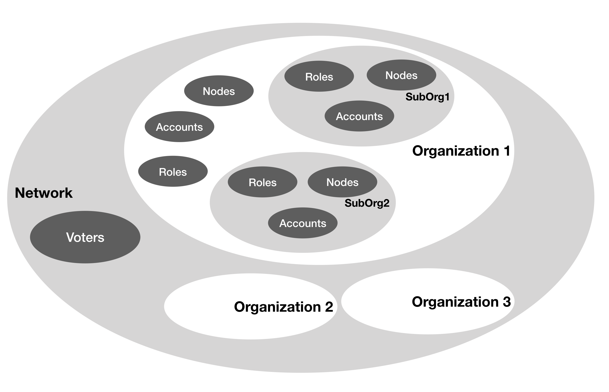
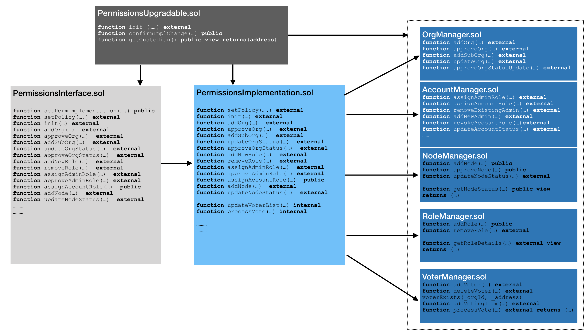

# Introduction
The current permission model with in Quorum is limited to node level permissions only and allows a set of nodes which are part of `permissioned-nodes.json` to join the network. Considering the enterprise level needs for private and consortium blockchains, the permissionsing model has been enhanced inline with EEA(Enterprise Ethereum Alliance) specs. The overview of the mode is as depicted below:
  
### Key Definitions
* Network - A set of organizations
* Organization - A set of Ethereum accounts, nodes having varied permissions to interact with the network
* Sub Organization - Further sub grouping with in the Organization as per business need
* Account - An Ethereum account 
* Voter - An account capable of voting for a certain action
* Role - A named job function in organization
* Node - A geth node which is part of the network and belongs to an organization or sub organization

As depicted above, in the enhanced permissions model, the network comprises of group of organization. The network admin accounts defined at network level can propose and approve new organizations to join the network and assign an account as the organization administration account. The organization admin account can in turn creates roles, sub organizations, assign roles to its accounts and add any other node which is part of the organization. The sub organizations in turn can have its own set of roles accounts and sub organizations. The organization administration account manages and controls all activities at the organization level. The organization administrator can create an admin role and assign the same to a different account to manage the administration of a sub organization. The access rights of an account are derived based on the role assigned to it. The account will be able to transact via any node linked to the sub org or at overall organizations level.  

### Smart Contract design for permissions
The permissions model is completely built on smart contracts. The smart contract design is as below:


The permissions smart contract design follows the Proxy-Implementation-Storage pattern which allows the implementation logic to change without changing the storage or interface layer. Brief description of the smart contracts is as below:
* `PermissionsUpgradable.sol`: This contract stores the address of current implementation contract and is owned by a custodian(an Ethereum account). Only custodian is allowed to change the implementation contract address. 
* `PermissionsInterface.sol`: This is the interface contract and holds the interfaces for permissions related actions. This does not have any business logic and it forwards requests to current implementation contract
* `PermissionsImplementation.sol`: This contract has the business logic for the permissions actions. This contract can receive requests only from a valid interface as defined in `PermissionsUpgradable.sol` and interact with all the storage contracts for respective actions.
* `OrgManager.sol`: This contract stores data for organizations and sub organizations. This contract can receive request from valid implementation contract as defined in `PermissionsUpgrdable.sol`
* `AccountManager.sol`: This contract receives requests from valid implementation contract as defined in `PermissionsUpgrdable.sol`. This contracts stores the data of all accounts, their linkage to organization and various roles. This contracts also stores the status of an account. The account can be in any of the following states - `PendingApproval`, `Active`, `Suspended`, `Blacklisted`, `Revoked`
* `NodeManager.sol`: This contract receives requests from valid implementation contract as defined in `PermissionsUpgrdable.sol`. This contracts stores the data of a node, its linkage to a organization or sub organization and status of the node. The node status can be any one of the following states - `PendingApproval`, `Active`, `Deactivated`, `Blacklisted`
* `RoleManager.sol`: This contract receives requests from valid implementation contract as defined in `PermissionsUpgrdable.sol`. This contract stores data for various roles and the organization to which it is linked. At access at role level can be any one of the following: `Readonly` which allows only read operations, `Transact` which allows value transfer but no contract deployment access, `ContractDeploy` which allows both value transfer and contract deployment access and `FullAccess` which allows additional network level accesses in addition to value transfer and contract deployment. If a role is revoked all accounts which are linked to the role lose all access rights.
* `VoterManager.sol`: This contract receives requests from valid implementation contract as defined in `PermissionsUpgrdable.sol`. This contract stores the data of valid voters at network level which can approve identified activities e.g. adding a new organization to the network. Any account which is linked to a predefined network admin role will be marked as a voter. Whenever a network level activity which requires voting is performed, a voting item is added to this contract and each voter account can vote for the activity. The activity is marked as `Approved` upon majority voting.

## Set up
The steps to enable new permissions model are as described below:
* For a new network, bring up the initial set of nodes which will be part of the network
* Deploy the `PermissionsUpgradable.sol` in the network. The deployment of this contract will require a custodian account to be given as a part of deployment. 
* Deploy the rest of the contracts. All the other contracts will require the address of `PermissionsUpgradable.sol` contract as a part of deployment.
* Once all the contracts are deployed create a file `permission-config.json` which will have the following construct:
```$xslt
{
        "upgrdableAddress": "0x1932c48b2bf8102ba33b4a6b545c32236e342f34",
        "interfaceAddress": "0x4d3bfd7821e237ffe84209d8e638f9f309865b87",
        "impladdress": "0xfe0602d820f42800e3ef3f89e1c39cd15f78d283",
        "nodeMgraddress": "0x8a5e2a6343108babed07899510fb42297938d41f",
        "accountMgraddress": "0x9d13c6d3afe1721beef56b55d303b09e021e27ab",
        "roleMgraddress": "0x1349f3e1b8d71effb47b840594ff27da7e603d17",
        "voterMgraddress": "0xd9d64b7dc034fafdba5dc2902875a67b5d586420",
        "orgMgraddress" : "0x938781b9796aea6376e40ca158f67fa89d5d8a18",
        "nwAdminOrg": "INITORG",
        "nwAdminRole" : "NWADMIN",
        "orgAdminRole" : "ORGADMIN",
        "accounts":["0xed9d02e382b34818e88b88a309c7fe71e65f419d", "0xca843569e3427144cead5e4d5999a3d0ccf92b8e"],
        "subOrgBreadth" : "3",
        "subOrgDepth" : "4"
}
```
> * `upgrdableAddress` is the address of deployed contract `PermissionsUpgradable.sol`
> * `interfaceAddress` is the address of deployed contract `PermissionsInterface.sol`
> * `impladdress` is the address of deployed contract `PermissionsImplementation.sol`
> * `nodeMgraddress` is the address of deployed contract `NodeManager.sol`
> * `accountMgraddress` is the address of deployed contract `AccountManager.sol`
> * `roleMgraddress` is the address of deployed contract `RoleManager.sol`
> * `voterMgraddress` is the address of deployed contract `VoterManager.sol`
> * `orgMgraddress` is the address of deployed contract `OrgManager.sol`
> * `nwAdminOrg` is the name of initial organization that will be created as a part of network boot up with new permissions model. This organization will own all the initial nodes which come at the time of network boot up and accounts which will be the network admin account
> * `nwAdminRole` is role id for which will have full access and will be network admin
> * `accounts` holds the initial list of accounts which will be linked to the network admin organization and will be assigned the network admin role. These accounts will have complete control on the network and can propose and approve new organizations into the network
> * `subOrgBreadth` indicates the number of sub organizations that any org can have
> * `subOrgDepth` indicates the maximum depth sub org hierarchy allowed in the network

* Bring down the all `geth` nodes in network and copy `permission-config.json` into the data directory of each of the node
* Bring up all `geth` nodes in `--permissioned` mode for new permissions model to take effect

### Permission APIs
#### quorumPermission.orgList 
* Input: None
* Output: Returns the list of all organizations and their status 
* Example:
```
> quorumPermission.orgList
[{
    fullOrgId: "INITORG",
    level: 1,
    orgId: "INITORG",
    parentOrgId: "",
    status: 2,
    subOrgList: null,
    ultimateParent: "INITORG"
}]
```
#### quorumPermission.acctList 
* Input: None
* Output: Returns the list of all accounts across organizations 
* Example:
```
> quorumPermission.acctList
[{
    acctId: "0xed9d02e382b34818e88b88a309c7fe71e65f419d",
    isOrgAdmin: true,
    orgId: "INITORG",
    roleId: "NWADMIN",
    status: 2
}, {
    acctId: "0xca843569e3427144cead5e4d5999a3d0ccf92b8e",
    isOrgAdmin: true,
    orgId: "INITORG",
    roleId: "NWADMIN",
    status: 2
}]
```
#### quorumPermission.nodeList 
* Input: None
* Output: Returns the list of all nodes across organizations 
* Example:
```
> quorumPermission.nodeList
[{
    orgId: "INITORG",
    status: 2,
    url: "enode://72c0572f7a2492cffb5efc3463ef350c68a0446402a123dacec9db5c378789205b525b3f5f623f7548379ab0e5957110bffcf43a6115e450890f97a9f65a681a@127.0.0.1:21000?discport=0"
}, {
    orgId: "INITORG",
    status: 2,
    url: "enode://7a1e3b5c6ad614086a4e5fb55b6fe0a7cf7a7ac92ac3a60e6033de29df14148e7a6a7b4461eb70639df9aa379bd77487937bea0a8da862142b12d326c7285742@127.0.0.1:21001?discport=0"
}, {
    orgId: "INITORG",
    status: 2,
    url: "enode://5085e86db5324ca4a55aeccfbb35befb412def36e6bc74f166102796ac3c8af3cc83a5dec9c32e6fd6d359b779dba9a911da8f3e722cb11eb4e10694c59fd4a1@127.0.0.1:21002?discport=0"
}, {
    orgId: "INITORG",
    status: 2,
    url: "enode://28a4afcf56ee5e435c65b9581fc36896cc684695fa1db83c9568de4353dc6664b5cab09694d9427e9cf26a5cd2ac2fb45a63b43bb24e46ee121f21beb3a7865e@127.0.0.1:21003?discport=0"
}]
```
#### quorumPermission.roleList 
* Input: None
* Output: Returns the list of all roles across organizations and their details
* Example:
```
> quorumPermission.roleList
[{
    access: 3,
    active: true,
    isAdmin: true,
    isVoter: true,
    orgId: "INITORG",
    roleId: "NWADMIN"
}]
```
#### quorumPermission.getOrgDetails 
This returns the list of accounts, nodes, roles, sub organizations linked to an organization
* Input: idrganization or sub organization id
* Output: list of all accounts, roles, nodes and sub orgs
* Example:
```
> quorumPermission.getOrgDetails("INITORG")
{
  acctList: [{
      acctId: "0xed9d02e382b34818e88b88a309c7fe71e65f419d",
      isOrgAdmin: true,
      orgId: "INITORG",
      roleId: "NWADMIN",
      status: 2
  }, {
      acctId: "0xca843569e3427144cead5e4d5999a3d0ccf92b8e",
      isOrgAdmin: true,
      orgId: "INITORG",
      roleId: "NWADMIN",
      status: 2
  }],
  nodeList: [{
      orgId: "INITORG",
      status: 2,
      url: "enode://72c0572f7a2492cffb5efc3463ef350c68a0446402a123dacec9db5c378789205b525b3f5f623f7548379ab0e5957110bffcf43a6115e450890f97a9f65a681a@127.0.0.1:21000?discport=0"
  }, {
      orgId: "INITORG",
      status: 2,
      url: "enode://7a1e3b5c6ad614086a4e5fb55b6fe0a7cf7a7ac92ac3a60e6033de29df14148e7a6a7b4461eb70639df9aa379bd77487937bea0a8da862142b12d326c7285742@127.0.0.1:21001?discport=0"
  }, {
      orgId: "INITORG",
      status: 2,
      url: "enode://5085e86db5324ca4a55aeccfbb35befb412def36e6bc74f166102796ac3c8af3cc83a5dec9c32e6fd6d359b779dba9a911da8f3e722cb11eb4e10694c59fd4a1@127.0.0.1:21002?discport=0"
  }, {
      orgId: "INITORG",
      status: 2,
      url: "enode://28a4afcf56ee5e435c65b9581fc36896cc684695fa1db83c9568de4353dc6664b5cab09694d9427e9cf26a5cd2ac2fb45a63b43bb24e46ee121f21beb3a7865e@127.0.0.1:21003?discport=0"
  }],
  roleList: [{
      access: 3,
      active: true,
      isAdmin: true,
      isVoter: true,
      orgId: "INITORG",
      roleId: "NWADMIN"
  }],
  subOrgList: null
}
```
#### quorumPermission.addOrg 
This api can be executed by a network admin account only for proposing a new organization into the network
* Input: Unique organization id, enode id, account id
* Output: Status of the operation
* Example:
```
> quorumPermission.addOrg("ABC", "enode://3d9ca5956b38557aba991e31cf510d4df641dce9cc26bfeb7de082f0c07abb6ede3a58410c8f249dabeecee4ad3979929ac4c7c496ad20b8cfdd061b7401b4f5@127.0.0.1:21003?discport=0&raftport=50404", "0x0638e1574728b6d862dd5d3a3e0942c3be47d996", {from: eth.accounts[0]})
{
  msg: "Action completed successfully",
  status: true
}
```
If there any pending items for approval, proposal of any new organization will fail. Also the enode id and accounts can be linked to one organization only. 
```
> quorumPermission.addOrg("ABC", "enode://3d9ca5956b38557aba991e31cf510d4df641dce9cc26bfeb7de082f0c07abb6ede3a58410c8f249dabeecee4ad3979929ac4c7c496ad20b8cfdd061b7401b4f5@127.0.0.1:21003?discport=0&raftport=50404", "0x0638e1574728b6d862dd5d3a3e0942c3be47d996", {from: eth.accounts[0]})
{
  msg: "Pending approvals for the organization. Approve first",
  status: false
}
> quorumPermission.addOrg("XYZ", "enode://3d9ca5956b38557aba991e31cf510d4df641dce9cc26bfeb7de082f0c07abb6ede3a58410c8f249dabeecee4ad3979929ac4c7c496ad20b8cfdd061b7401b4f5@127.0.0.1:21003?discport=0&raftport=50404", "0x0638e1574728b6d862dd5d3a3e0942c3be47d996", {from: eth.accounts[0]})
{
  msg: "EnodeId already part of network.",
  status: false
}
> quorumPermission.addOrg("XYZ", "enode://de9c2d5937e599930832cecc1df8cc90b50839bdf635c1a4e68e1dab2d001cd4a11c626e155078cc65958a72e2d72c1342a28909775edd99cc39470172cce0ac@127.0.0.1:21004?discport=0", "0x0638e1574728b6d862dd5d3a3e0942c3be47d996", {from: eth.accounts[0]})
{
  msg: "Account already in use in another organization",
  status: false
}

```

#### quorumPermission.approveOrg 
This api can be executed by a network admin account only for approving a proposed organization into the network
* Input: Unique organization id, enode id, account id
* Output: Status of the operation
* Example:
```
quorumPermission.approveOrg("ABC", "enode://3d9ca5956b38557aba991e31cf510d4df641dce9cc26bfeb7de082f0c07abb6ede3a58410c8f249dabeecee4ad3979929ac4c7c496ad20b8cfdd061b7401b4f5@127.0.0.1:21003?discport=0&raftport=50404", "0x0638e1574728b6d862dd5d3a3e0942c3be47d996", {from: eth.accounts[0]})
{
  msg: "Action completed successfully",
  status: true
}
```
#### quorumPermission.updateOrgStatus
This api can be executed by a network admin account only for temporarily suspending an organization and re-enabling a suspended organization. This activity can be performed for master organization only and requires majority approval from network admins.
* Input: organization id, action (3 for suspending the organization and 5 for re-enabling the suspended organization)
* Output: Status of the operation
* Example:
```$xslt
> quorumPermission.updateOrgStatus("ABC.SUB1", 3, {from:eth.accounts[0]})
{
  msg: "Action completed successfully",
  status: true
}
```
#### quorumPermission.approveOrgStatus
This api can be executed by a network admin account only for approving the org status change proposal.  Once majority approval is received from network admins, the org status is updated.
* Input: organization id, action (3 for suspending the organization and 5 for re-enabling the suspended organization)
* Output: Status of the operation
* Example:
```$xslt
> quorumPermission.approveOrgStatus("ABC", 3, {from: eth.accounts[0]})
{
  msg: "Action completed successfully",
  status: true
}
```
When a org is in suspended status, no transactions or contract deploy activities are allowed from any nodes linked to the org and sub organizations under it. Similarly no transactions will be allowed from any accounts linked to the organization

#### quorumPermission.addSubOrg 
This api can be executed by a organization admin account to create a sub organization under under the master org. 
* Input: parent org id, Sub organization id,  enode id ( not mandatory and can be null), account id (not mandatory and can be 0x0)
* Output: Status of the operation
* Example:
```
> quorumPermission.addSubOrg("ABC", "SUB1", "", "0x0000000000000000000000000000000000000000", {from: eth.accounts[0]})

{
  msg: "Action completed successfully",
  status: true
}
```
For adding a sub organization at next level the parent org id should have the entire org hierarchy upto the immediate parent. e.g.
```
> quorumPermission.addSubOrg("ABC.SUB1", "SUB2","", "0x0000000000000000000000000000000000000000", {from: eth.accounts[0]})
{
  msg: "Action completed successfully",
  status: true
}
> quorumPermission.addSubOrg("ABC.SUB1.SUB2", "SUB3","", "0x0000000000000000000000000000000000000000", {from: eth.accounts[0]})
{
  msg: "Action completed successfully",
  status: true
}
```
#### quorumPermission.addNewRole
This api can be executed by organization admin account to create a new role for the organization
* Input: org or sub org id, role id, account access(can be 0 - ReadOnly, 1 - Transact, 2 - ContractDeploy, 3 - FullAccess), isVoter, isAdminRole
* Output: Status of the operation
* Example:
```
> quorumPermission.addNewRole("ABC", "TRANSACT", 1, false, false,{from: eth.accounts[0]})
{
  msg: "Action completed successfully",
  status: true
}
> quorumPermission.addNewRole("ABC.SUB1.SUB2.SUB3", "TRANSACT", 1, false, false,{from: eth.accounts[0]})
{
  msg: "Action completed successfully",
  status: true
}
```
#### quorumPermission.removeRole
This api can be executed by organization admin account to create a new role for the organization
* Input: org or sub org id, role id
* Output: Status of the operation
* Example:
```
> quorumPermission.removeRole("ABC.SUB1.SUB2.SUB3", "TRANSACT", {from: eth.accounts[1]})
{
  msg: "Action completed successfully",
  status: true
}
```
#### quorumPermission.assignAccountRole
This api can be executed by organization admin account to assign a role to an account
* Input: Account id, org or sub org id, role to be assigned
* Output: Status of the operation
* Example:
```
> quorumPermission.assignAccountRole("0xf017976fdf1521de2e108e63b423380307f501f8", "ABC", "TRANSACT", {from: eth.accounts[1]})
{
  msg: "Action completed successfully",
  status: true
}
```
The account can be linked to a organization or sub organization only and cannot belong to multiple organizations or sub organizations
```$xslt
> quorumPermission.assignAccountRole("0xf017976fdf1521de2e108e63b423380307f501f8", "ABC.SUB1", "TRANSACT", {from: eth.accounts[1]})
{
  msg: "Account already in use in another organization",
  status: false
}
```
#### quorumPermission.updateAccountStatus
This api can be executed by organization admin account to update the account status
* Input:  org or sub org id, Account id, action (1 for suspending the account, 2 for activating a suspended account, 3 for blacklisting the account)
* Output: Status of the operation
* Example:
```
> quorumPermission.updateAccountStatus("ABC", "0xf017976fdf1521de2e108e63b423380307f501f8", 1, {from: eth.accounts[1]})
{
  msg: "Action completed successfully",
  status: true
}
```
Once a account is blacklisted no further action is allowed on it

#### quorumPermission.assignAdminRole
This api can be executed by network admin to add a new account as network admin or change the org admin account for a organization 
* Input: org id to which the account belongs, account id, role id (it can be either org admin role or network admin role)
* Output: Status of the operation
* Example:
```
> quorumPermission.assignAdminRole("ABC", "0xf017976fdf1521de2e108e63b423380307f501f8", "NWADMIN", {from: eth.accounts[0]})
{
  msg: "Action completed successfully",
  status: true
}
```

#### quorumPermission.approveAdminRole 
This api can be executed by network admin to add approve the org admin or network admin role assignment to an account. The role is approved once majority approvals is received
* Input: org id to which the account belongs, account id
* Output: Status of the operation
* Example:
```
> quorumPermission.approveAdminRole("ABC", "0xf017976fdf1521de2e108e63b423380307f501f8",  {from: eth.accounts[0]})

{
  msg: "Action completed successfully",
  status: true
}
```

#### quorumPermission.addNode
This api can be executed by organization admin account to add a node to the org or sub org
* Input:  org or sub org id, enode id
* Output: Status of the operation
* Example:
```
> quorumPermission.addNode("ABC.SUB1.SUB2.SUB3", "enode://239c1f044a2b03b6c4713109af036b775c5418fe4ca63b04b1ce00124af00ddab7cc088fc46020cdc783b6207efe624551be4c06a994993d8d70f684688fb7cf@127.0.0.1:21006?discport=0&raftport=50407", {from: eth.accounts[1]})
{
  msg: "Action completed successfully",
  status: true
}
```
A node cannot be part of multiple organizations. 

#### quorumPermission.updateNodeStatus
This api can be executed by organization admin account to update the status of a node
* Input:  org or sub org id, enode id, action (3 for deactivating the node, 4 for activating a deactivated node and 5 for blacklisting a node)
* Output: Status of the operation
* Example:
```
> quorumPermission.updateNodeStatus("ABC.SUB1.SUB2.SUB3", "enode://239c1f044a2b03b6c4713109af036b775c5418fe4ca63b04b1ce00124af00ddab7cc088fc46020cdc783b6207efe624551be4c06a994993d8d70f684688fb7cf@127.0.0.1:21006?discport=0&raftport=50407",3, {from: eth.accounts[1]})
{
  msg: "Action completed successfully",
  status: true
}
```
Once a node is blacklisted no further action is possible on the same.

### General validations for account access
The table below indicates the numeric value for each account access type.

| AccessType      |           Value |
| :-------------: | :-------------: |
| ReadOnly        |               0 |
| Transact        |               1 |
| Contract deploy |               2 |
| Full access     |               3 |

While setting the account access, system checks if the account which is setting the access has sufficient privileges to perform the activity. 
* Accounts with `FullAccess` can grant any access type ( FullAccess, Transact, ContractDeploy or ReadOnly) to any other account
* Accounts with `ContractDeploy` can grant only `Transact`, `ContractDeploy` or `ReadOnly` access to other accounts
* Accounts with `Transact` access grant only `Transact` or `ReadOnly` access to other accounts
* Accounts with `ReadOnly` access cannot grant any access

